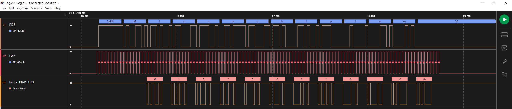
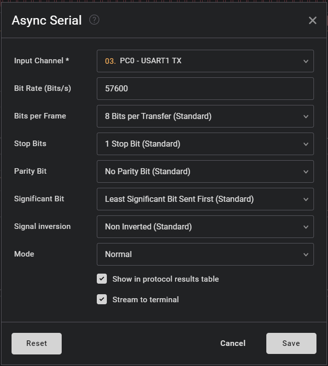

 # Bi-phase Decoder

The Bi-phase Mark Code (BMC) combines both data and clock in a single signal. One clock cycle is a BMC bit period. A transition always occurs at the beginning of each bit period. A logic `1` is represented by a transition (rising or falling edge) in the middle of the bit period.
A logic `0` is represented by no transition in the middle of the period. A BMC encoder accepts a data signal and clock signal as inputs and produces a single BMC-encoded output. A BMC decoder accepts a BMC-encoded signal as the input and produces two outputs: data and clock.
BMC is used in standards such as the USB 3.1 Power Delivery Specification CC signaling, AES3 digital audio, or S/PDIF audio.

An example is presented in the figure below:

 

This project is an implementation of a Bi-phase Decoder using CIP (Core Independent Peripherals) by following the interaction between TCA, TCB, Event System, CCL and SPI peripherals. The encoded data is received through a single data wire. The NRZ (Non-return-to-zero) signal and clock signal are recovered using the circuit composed of the CIP mentioned above. The resulting signals are routed to the SPI peripheral which reads the data. The decoded data is transmitted further via serial communication. 

The bi-phase encoded signal is received through a single wire. A decoding circuit is implemented using the combination between CCL, Event System and timers. The decoding circuit outputs the recovered NRZ data and a synchronized clock signal that are routed with jumper wires to the SPI peripheral configured in client mode. The SPI peripheral will generate interrupts whenever a new byte is received, and the current byte will be stored in a buffer. The data is further transmitted via serial communication (USART1). A time-out mechanism is implemented using TCA0 (an interrupt will be generated when no activity occurs on the bi-phase data line for the duration of 6 bytes). A FIFO (First-In First-Out) buffer mechanism is implemented in order to facilitate the data storage and minimze data loss.

The block diagram of this application is presented in the figure below: 

 

## Related Documentation
More details and code examples on the AVR128DA48 can be found at the following links:
- [AVR128DA48 Product Page](https://www.microchip.com/wwwproducts/en/AVR128DA48)
- [AVR128DA48 Code Examples on GitHub](https://github.com/microchip-pic-avr-examples?q=avr128da48)
- [AVR128DA48 Project Examples in START](https://start.atmel.com/#examples/AVR128DA48CuriosityNano)

## Software Used
- MPLAB® X IDE 5.45 or newer [(microchip.com/mplab/mplab-x-ide)](http://www.microchip.com/mplab/mplab-x-ide)
- MPLAB® XC8 2.31 or a newer compiler [(microchip.com/mplab/compilers)](http://www.microchip.com/mplab/compilers)
- MPLAB® Code Configurator (MCC) 4.0.2 or newer [(microchip.com/mplab/mplab-code-configurator)](https://www.microchip.com/mplab/mplab-code-configurator)
- MPLAB® Code Configurator (MCC) Device Libraries 8-bit AVR MCUs 2.5.0 or newer [(microchip.com/mplab/mplab-code-configurator)](https://www.microchip.com/mplab/mplab-code-configurator)
- AVR-Dx_DFP 1.6.88 or newer Device Pack

## Hardware Used
- AVR128DA48 Curiosity Nano [(DM164151)](https://www.microchip.com/Developmenttools/ProductDetails/DM164151)
- Three Jumper wires

## Setup

The AVR128DA48 Curiosity Nano Development Board is used as test platform.

  
 
The following configurations must be made for this project:

System clock: 24 MHz

Global interrupts: Enabled

USART1:
  - 57600 baud rate
  - TX enabled
  - Async mode
  - 8N1 (character size: 8 bit, no parity, 1 stop bit)

SPI0:
  - Client mode selected
  - SPI Mode 3
  - Alternate pins selected

TCA0:
  - 16 bit (Normal) mode
  - Actual time-out: 1.5 ms
  - Overflow Interrupt Enabled
  - EVCTRL: CNTBEI - Enabled
  - EVACTB - Restart counter on any edge event

TCB0:
  - Single Shot mode
  - Clock Source: CLKPER
  - Asynchronous mode: Enabled
  - Input Capture Event: Enabled
  - Timer period: 24 us

TCB1:
  - Periodic Time-out mode
  - Clock Source: CLKPER
  - Asynchronous mode: Enabled
  - Input Capture Event: Enabled
  - Timer period: 1 us

TCB2:
  - Single Shot mode
  - Clock Source: CLKPER
  - Input Capture Event: Enabled
  - Noise Cancellation Filter: Enabled
  - Capture/Time-out interrupt: Enabled
  - Timer period: 1 us

TCB3:
  - Single Shot mode
  - Clock Source: CLKPER
  - Input Capture Event: Enabled
  - Noise Cancellation Filter: Enabled
  - Capture/Time-out interrupt: Enabled
  - Timer period: 18 us

LUT0:
  - IN0: EVENT A
  - IN1: Masked
  - IN2: Masked
  - TRUTH table: 0x02
  - Clock source: CLKPER
  - Output Enabled
  - Sequential Logic: DFF

LUT1:
  - IN0: Masked
  - IN1: TCB1
  - IN2: Masked
  - TRUTH table: 0x04
  - Clock source: CLKPER
  - Output Enabled
  - Sequential Logic: DFF

LUT2:
  - IN0: EVENT A
  - IN1: EVENT B
  - IN2: Masked
  - TRUTH table: 0x09
  - Clock source: CLKPER
  - Output Enabled
  - Sequential Logic: DFF

LUT3:
  - IN0: Masked
  - IN1: Masked
  - IN2: TCB2
  - TRUTH table: 0x10
  - Clock source: CLKPER
  - Output Enabled
  - Sequential Logic: DFF

LUT4:
  - IN0: IN0
  - IN1: Masked
  - IN2: Masked
  - TRUTH table: 0x02
  - Clock source: CLKPER
  - Output Enabled

LUT5:
  - IN0: EVENT A
  - IN1: Masked
  - IN2: Masked
  - TRUTH table: 0x01
  - Clock source: CLKPER

EVSYS:
  - Event Generators:
    - CCL_LUT4:  CHANNEL0
    - TCB0_CAPT: CHANNEL1
    - CCL_LUT0:  CHANNEL2
    - TCB3_CAPT: CHANNEL3
    - CCL_LUT5:  CHANNEL4
  - Event Users:
    - CHANNEL0: CCLLUT0A, CCLLUT2A, TCA0CNTB, TCB0CAPT, TCB3CAPT
    - CHANNEL1: TCB1CAPT
    - CHANNEL2: CCLLUT2B
    - CHANNEL3: CCLLUT5A
    - CHANNEL4: TCB2CAPT

 |Pin                       | Configuration      |
 | :---------------------:  | :----------------: |
 |     PC0 (USART1 - TX)    |   Digital Output   |
 |     PC1 (USART1 - RX)    |    Digital Input   |
 |     PB0 (LUT4_INSEL0) - Encoded Bi-phase Signal    |    Digital Input   |
 |     PD3 (LUT2_OUT) - Recovered NRZ Data Signal    |   Digital Output   |
 |     PA2 (TCB0_OUT) - Recovered Clock Signal     |   Digital Output   |
 |     PE0 (SPI0 - MOSI)    |    Digital Input   |
 |     PE2 (SPI0 - SCK)     |    Digital Input   |

 Additional connections needed (with two jumper wires):

 |Pin 1                      | Pin 2      |
 | :---------------------:  | :----------------: |
 |     PD3 (LUT2_OUT) - Recovered NRZ Data Signal |   PE0 - SPI0 MOSI   |
 |     PA2 (TCB0_OUT) - Recovered Clock Signal    |   PE2 - SPI0 SCK    |

**Important:** The encoder's board PB3 pin must be connected with the decoder's board PB0 pin (bi-phase data bus).

## Software
 Decoder Software Flowchart

  

 ## Operation
 1. Connect the board to the PC.

 2. Open the avr128da48-cnano-biphase-decoder-mplab-mcc.X project in MPLAB X.

 3. Set the avr128da48-cnano-biphase-decoder-mplab-mcc.X project as main project. Right click on the project in the **Projects** tab and click **Set as Main Project**.
 
  

 4. Clean and build the avr128da48-cnano-biphase-decoder-mplab-mcc.X project: Right click on the **avr128da48-cnano-biphase-decoder-mplab-mcc.X** project and select **Clean and Build**.

  

 5. Select the **AVR128DA48 Curiosity Nano** in the Connected Hardware Tool section of the project settings:
   - Right click on the project and click **Properties**
   - Click on the arrow right next to Connected Hardware Tool
   - Select the **AVR128DA48 Curiosity Nano** (click on the **SN**), click **Apply**, and then click **OK**:

    

 6. Program the project to the board: Right click on the project and click **Make and Program Device**.

 

 Demo:

In the demo, the 'Microchip !!!' message is received in the serial terminal connected to the decoder board. Also, the recovered NRZ and clock signal can be visualized with a logic analyzer.

 
 
 
 

 ## Summary

This demo shows how to implement a CIP solution for a bi-phase decoder using a circuit composed of SPI, USART, CCL, Timers and Event System peripherals. This CIP solution can be used at high baud rates, the decoding process being implemented in the CIP circuit, and the CPU is used only at storing the received data in a buffer.
