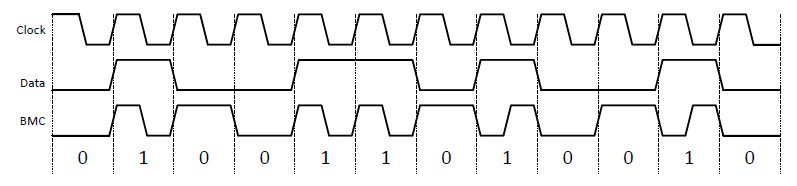
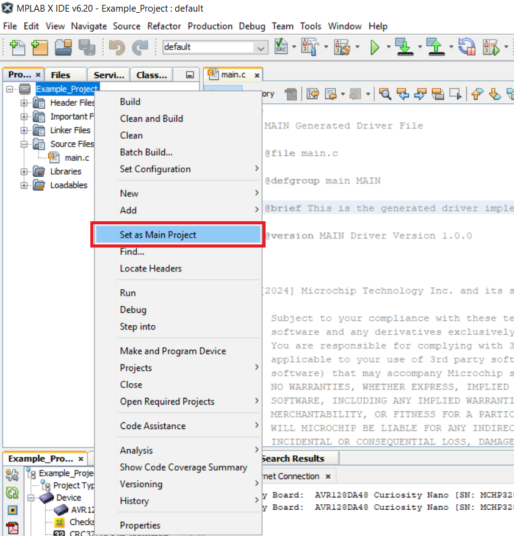

[](https://www.microchip.com)

 # Bi-phase Decoder - Use Case for CIPs Using the AVR128DA48 Microcontroller with MCC Melody

The Bi-phase Mark Code (BMC) combines both data and clock in a single signal. One clock cycle is a BMC bit period. A transition always occurs at the beginning of each bit period. A logic ```1``` is represented by a transition (rising or falling edge) in the middle of the bit period.
A logic ```0``` is represented by no transition in the middle of the period. A BMC encoder accepts a data signal and clock signal as inputs and produces a single BMC-encoded output. A BMC decoder accepts a BMC-encoded signal as the input and produces two outputs: data and clock.
BMC is used in standards such as the USB 3.1 Power Delivery Specification CC signaling, AES3 digital audio, or S/PDIF audio.

An example is presented in the figure below:

<br>

## Related Documentation

More details and code examples on the AVR128DA48 can be found at the following links:
- [AVR128DA48 Product Page](https://www.microchip.com/wwwproducts/en/AVR128DA48)
- [AVR128DA48 Code Examples on Discover](https://mplab-discover.microchip.com/v2?dsl=avr128da48)
- [AVR128DA48 Code Examples on GitHub](https://github.com/microchip-pic-avr-examples?q=avr128da48)

## Software Used
- [MPLAB X IDE v6.20 or newer](https://www.microchip.com/en-us/tools-resources/develop/mplab-x-ide)
- [MPLAB XC8 v2.46 or newer](https://www.microchip.com/en-us/tools-resources/develop/mplab-xc-compilers/xc8)
- [AVR-Dx_DFP v2.4.286 or newer](https://packs.download.microchip.com/)

## Hardware Used
- The [AVR128DA48 Curiosity Nano Development board (DM164151)](https://www.microchip.com/Developmenttools/ProductDetails/DM164151) is used as a test platform:
<br>

## Operation

To program the Curiosity Nano board with this MPLAB X project, follow the steps provided in the [How to Program the Curiosity Nano Board](#how-to-program-the-curiosity-nano-board) chapter.<br><br>

## Concept

This project is an implementation of a Bi-phase Decoder using CIP (Core Independent Peripherals) by following the interaction between TCA, TCB, EVSYS, CCL and SPI peripherals. The encoded data is received through a single data wire. The Non-Return-to-Zero (NRZ) signal and clock signal are recovered using the circuit composed of the CIP mentioned above. The resulting signals are routed to the SPI peripheral which reads the data. The decoded data is transmitted further via serial communication. 

The bi-phase encoded signal is received through a single wire. A decoding circuit is implemented using the combination between CCL, EVSYS and timers. The decoding circuit outputs the recovered NRZ data and a synchronized clock signal that are routed with jumper wires to the SPI peripheral configured in client mode. The SPI peripheral will generate interrupts whenever a new byte is received, and the current byte will be stored in an internal MCC generated buffer. The data is further transmitted via serial communication (USART1). A time-out mechanism is implemented using TCA0 (an interrupt will be generated when no activity occurs on the bi-phase data line for the duration of 6 bytes). A FIFO (First-In First-Out) buffer mechanism is already implemented via MCC generated code in order to facilitate the data storage and minimize data loss.

The block diagram of this application is presented in the figure below: 

<br>

After initializing all the peripherals, the data received from the encoder device is received by the SPI peripheral and stored into the internal buffer (spi0_descriptor.buffer) via SPI receive interrupt. In the main function, the data from the receive buffer is read byte by byte until the end and follows the flowchart below. A start of frame (SOF) byte and a stop byte describe each message stored into the internal buffer. A timeout mechanism is implemented using TCA0, an interrupt will be generated when no activity occurs on the bi-phase data line for the duration of 6 bytes, to decide the SOF.

<br>


## Setup

The following peripheral and clock configurations are set up using the MPLAB Code Configurator (MCC) Melody for the AVR128DA48:

1. Clock Control:
  - Oscillator Frequency Selection: 24 MHz system clock
  <br>

2. USART1:
  - UART PLIB Selector: USART1
  - Enable USART Transmitter: Enabled
  - Requested Baudrate: 57600
  - Data Size: 8
  - Stop Bits: 1
  - Redirect Printf to UART: Enabled
  <br>

3. SPI0:
  - SPI Client PLIB Selector: SPI0
  - SPI0 Type: Client
  - SPI0 Mode: Mode 3
  - Config Name: CLIENT_CONFIG
  - Interrupt Driven: Enabled
  <br>

4. EVSYS:
  - Event Generators:
    - CCL_LUT4:  CHANNEL0
    - TCB0_CAPT: CHANNEL1
    - CCL_LUT0:  CHANNEL2
    - TCB3_CAPT: CHANNEL3
    - CCL_LUT5:  CHANNEL4
  - Event Users:
    - CHANNEL0: CCLLUT0A, CCLLUT2A, TCA0CNTB, TCB0CAPT, TCB3CAPT
    - CHANNEL1: TCB1CAPT
    - CHANNEL2: CCLLUT2B
    - CHANNEL3: CCLLUT5A
    - CHANNEL4: TCB2CAPT

5. CCL:
  - Enable CCL: Enabled
  - LUT0:
    - Enable LUT: Enabled
    - Enable LUT output: Enabled
    - Filter Options: DISABLE
    - Clock Selection: CLKPER
    - Sequential Logic: DFF
    - IN0: EVENTA
    - IN1: MASK
    - IN2: MASK
    - Gate Type: Custom
    - OUT result: 0x2

  - LUT1:
    - Enable LUT: Enabled
    - Enable LUT output: Enabled
    - Filter Options: DISABLE
    - Clock Selection: CLKPER
    - Sequential Logic: DFF
    - IN0: MASK
    - IN1: TCB1
    - IN2: MASK
    - Gate Type: Custom
    - OUT result: 0x4

  - LUT2:
    - Enable LUT: Enabled
    - Enable LUT output: Enabled
    - Filter Options: DISABLE
    - Clock Selection: CLKPER
    - Sequential Logic: DFF
    - IN0: EVENTA
    - IN1: EVENTB
    - IN2: MASK
    - Gate Type: Custom
    - OUT result: 0x9

  - LUT3:
    - Enable LUT: Enabled
    - Enable LUT output: Enabled
    - Filter Options: DISABLE
    - Clock Selection: CLKPER
    - Sequential Logic: DFF
    - IN0: MASK
    - IN1: MASK
    - IN2: TCB2
    - Gate Type: Custom
    - OUT result: 0x10

  - LUT4:
    - Enable LUT: Enabled
    - Enable LUT output: Enabled
    - Filter Options: DISABLE
    - Clock Selection: CLKPER
    - Sequential Logic: DFF
    - IN0: IN0
    - IN1: MASK
    - IN2: MASK
    - Gate Type: Custom
    - OUT result: 0x2

  - LUT5:
    - Enable LUT: Enabled
    - Enable LUT output: Enabled
    - Filter Options: DISABLE
    - Clock Selection: CLKPER
    - Sequential Logic: DISABLE
    - IN0: EVENTA
    - IN1: MASK
    - IN2: MASK
    - Gate Type: Custom
    - OUT result: 0x1

6. TCA0:
  - Enable Timer: Enabled
  - Clock Selection: System Clock
  - Timer Mode: 16 Bit (Normal)
  - Count Direction: UP
  - Requested Timeout (s): 0.0015 (1.5 ms)
  - Count on Event Input B: Enabled
  - Event Action B: RESTART_ANYEDGE
  - Enable Overflow Interrupt: Enabled
  - Waveform Generation Mode: Enabled
  <br>

7. TCB0:
  - Enable Timer: Enabled
  - Clock Selection: DIV1
  - Timer Mode: Single
  - Requested Timeout (s): 0.000024 (24 μs)
  - Enable Asynchronous: Enabled
  - Edge Event: Enabled
  - Enable Event Input Capture: Enabled
  - Enable Pin Output: Enabled
  <br>

8. TCB1:
  - Enable Timer: Enabled
  - Clock Selection: DIV1
  - Timer Mode: Single
  - Requested Timeout (s): 0.000001 (1 μs)
  - Enable Asynchronous: Enabled
  - Enable Event Input Capture: Enabled
  <br>

9. TCB2:
  - Enable Timer: Enabled
  - Clock Selection: DIV1
  - Timer Mode: Single
  - Requested Timeout (s): 0.000001 (1 μs)
  - Enable Asynchronous: Enabled
  - Enable Event Input Capture: Enabled
  - Generate ISR: Enabled
  - Enable Capture/Timeout Interrupt: Enabled
  <br>


10. TCB3:
  - Enable Timer: Enabled
  - Clock Selection: DIV1
  - Timer Mode: Single
  - Requested Timeout (s): 0.000018 (18 μs)
  - Enable Asynchronous: Enabled
  - Edge Event: Enabled
  - Enable Event Input Capture: Enabled
  - Generate ISR: Enabled
  - Enable Capture/Timeout Interrupt: Enabled
  <br>


11. Interrupt Manager:
  - Global Interrupt Enable: Enabled
  - SPI0 IE: Enabled
  - SPI0 RXC: Enabled
  - TCA0 OVFI: Enabled
  - TCB2 CAPT: Enabled
  - TCB3 CAPT: Enabled


 |Pin                       | Configuration      |
 | :---------------------:  | :----------------: |
 |     PA2 (TCB0_OUT) - Recovered Clock Signal     |   Digital Output   |
 |     PB0 (LUT4_INSEL0) - Encoded Bi-phase Signal    |    Digital Input   |
 |     PC0 (USART1 - TX)    |   Digital Output   |
 |     PD3 (LUT2_OUT) - Recovered NRZ Data Signal    |   Digital Output   |
 |     PE0 (SPI0 - MOSI)    |    Digital Input   |
 |     PE2 (SPI0 - SCK)     |    Digital Input   |

 Additional connections needed (with three jumper wires):

 |Pin 1                      | Pin 2      |
 | :---------------------:  | :----------------: |
 |     PA2 (TCB0_OUT) - Recovered Clock Signal    |   PE2 - SPI0 SCK    |
 |     PD3 (LUT2_OUT) - Recovered NRZ Data Signal |   PE0 - SPI0 MOSI   |
 |     PE3 (SPI0 SS)  - SPI0 Client Select        |   GND - Ground      |
 

**Important:** 
1. The encoder's board PB3 pin must be connected with the decoder's board PB0 pin (bi-phase data bus).
2. The SPI0 SS (Client Select) pin must be connected to GND.

## Demo:

In the demo, the ```Microchip!``` message is received in the serial terminal connected to the decoder board. Also, the recovered NRZ and clock signal can be visualized with a logic analyzer.

<br>

To use the embedded decoderS from the Logic software, the next analyzers settings must be set:

<br>
<br>

## Summary

This demo shows how to implement a CIP solution for a bi-phase decoder using a circuit composed of SPI, USART, CCL, Timers and Event System peripherals. This CIP solution can be used at high baud rates, the decoding process being implemented in the CIP circuit, and the CPU is used only at storing the received data in a buffer.

## How to Program the Curiosity Nano Board

This chapter demonstrates how to use the MPLAB X IDE to program an AVR® device with an Example_Project.X. This is applicable to other projects.

1.  Connect the board to the PC.

2.  Open the Example_Project.X project in MPLAB X IDE.

3.  Set the Example_Project.X project as main project.
    <br>Right click the project in the **Projects** tab and click **Set as Main Project**.
    <br>

4.  Clean and build the Example_Project.X project.
    <br>Right click the **Example_Project.X** project and select **Clean and Build**.
    <br>

5.  Select **AVRxxxxx Curiosity Nano** in the Connected Hardware Tool section of the project settings:
    <br>Right click the project and click **Properties**.
    <br>Click the arrow under the Connected Hardware Tool.
    <br>Select **AVRxxxxx Curiosity Nano** (click the **SN**), click **Apply** and then click **OK**:
    <br>

6.  Program the project to the board.
    <br>Right click the project and click **Make and Program Device**.
    <br>

<br>

- - - 
## Menu
- [Back to Top](#bi-phase-decoder---use-case-for-cips-using-the-avr128da48-microcontroller-with-mcc-melody)
- [Back to Related Documentation](#related-documentation)
- [Back to Software Used](#software-used)
- [Back to Hardware Used](#hardware-used)
- [Back to Operation](#operation)
- [Back to Concept](#concept)
- [Back to Setup](#setup)
- [Back to Demo](#demo)
- [Back to Summary](#summary)
- [Back to How to Program the Curiosity Nano Board](#how-to-program-the-curiosity-nano-board)