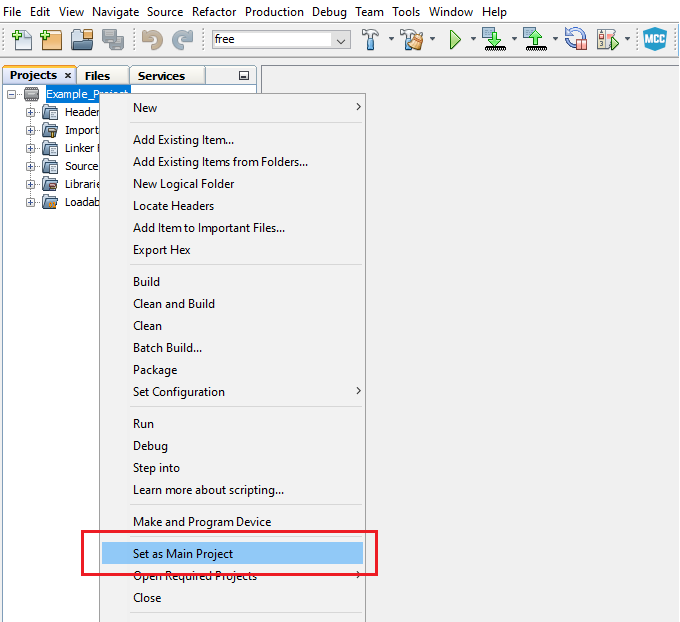
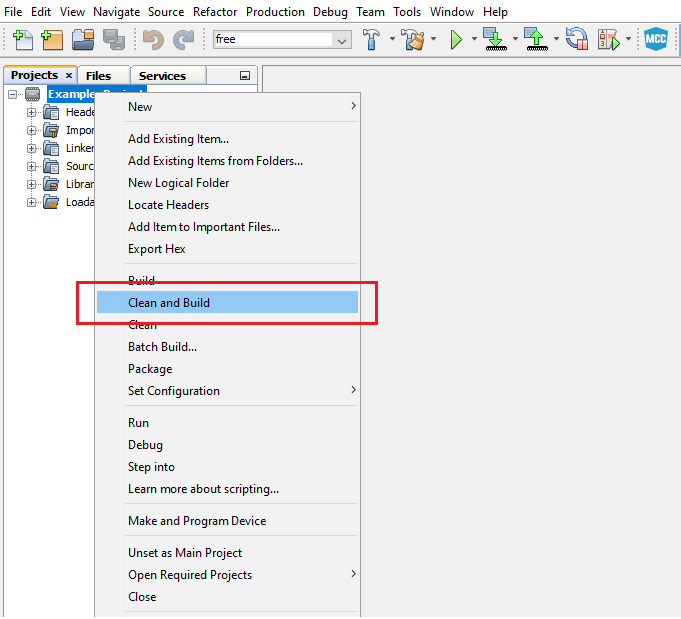

 # Bi-phase Encoder

The Bi-phase Mark Code (BMC) combines both data and clock in a single signal. One clock cycle is a BMC bit period. A transition always occurs at the beginning of each bit period. A logic `1` is represented by a transition (rising or falling edge) in the middle of the bit period.
A logic `0` is represented by no transition in the middle of the period. A BMC encoder accepts a data signal and clock signal as inputs and produces a single BMC-encoded output. A BMC decoder accepts a BMC-encoded signal as the input and produces two outputs: data and clock.
BMC is used in standards such as the USB 3.1 Power Delivery Specification CC signaling, AES3 digital audio, or S/PDIF audio.

An example is presented in the figure below:

 

This project is an implementation of a Bi-phase Encoder using CIPs by following the interaction between USART, Event System, SPI and CCL peripherals. The raw data is received via serial communication, encoded using the circuit composed of the CIP mentioned above and sent further through a single data wire. 

The raw data is received via serial communication by the USART1 peripheral. This data is then stored in a buffer and used as input for the SPI0 peripheral which generates NRZ (Non-return-to-zero) data signal and a clock signal. Those signals are selected as inputs for the circuit composed of CCL (Configurable Custom Logic) and Event System which outputs the Bi-phase encoded signal. A FIFO (First-In First-Out) buffer mechanism is implemented to facilitate the data storage and minimze data loss.

The block diagram of this application is presented in the figure below: 

 

## Related Documentation
More details and code examples on the AVR128DA48 can be found at the following links:
- [AVR128DA48 Product Page](https://www.microchip.com/wwwproducts/en/AVR128DA48)
- [AVR128DA48 Code Examples on GitHub](https://github.com/microchip-pic-avr-examples?q=avr128da48)
- [AVR128DA48 Project Examples in START](https://start.atmel.com/#examples/AVR128DA48CuriosityNano)

## Software Used
- MPLAB® X IDE 5.45 or newer [(microchip.com/mplab/mplab-x-ide)](http://www.microchip.com/mplab/mplab-x-ide)
- MPLAB® XC8 2.31 or a newer compiler [(microchip.com/mplab/compilers)](http://www.microchip.com/mplab/compilers)
- MPLAB® Code Configurator (MCC) 4.0.2 or newer [(microchip.com/mplab/mplab-code-configurator)](https://www.microchip.com/mplab/mplab-code-configurator)
- MPLAB® Code Configurator (MCC) Device Libraries 8-bit AVR MCUs 2.5.0 or newer [(microchip.com/mplab/mplab-code-configurator)](https://www.microchip.com/mplab/mplab-code-configurator)
- AVR-Dx_DFP 1.6.88 or newer Device Pack

## Hardware Used
- AVR128DA48 Curiosity Nano [(DM164151)](https://www.microchip.com/Developmenttools/ProductDetails/DM164151)

## Setup

The AVR128DA48 Curiosity Nano Development Board is used as test platform.

 

The following configurations must be made for this project:

System clock: 4 MHz

Global interrupts: Enabled

USART1:
  - 38400 baud rate
  - RX enabled
  - RXC interrupt enabled
  - Async mode
  - 8N1 (character size: 8 bit, no parity, 1 stop bit)

SPI0:
  - Master mode selected
  - SPI Mode 1
  - MSB transmitted first
  - Buffered Mode enabled (BUFEN = enabled)

EVSYS:
  - Event Generators:
    - CCL_LUT0: CHANNEL0
    - CCL_LUT2: CHANNEL1
    - CCL_LUT5: CHANNEL2
  - Event Users:
    - CHANNEL0: CCLLUT4A
    - CHANNEL1: CCLLUT4B
    - CHANNEL2: CCLLUT0A

LUT0:
  - IN0: SPI0
  - IN1: Feedback
  - IN2: EVENT A
  - TRUTH table: 0x66
  - Clock source: IN2
  - Output Enabled
  - Sequential Logic: DFF

LUT1:
  - IN0: Masked
  - IN1: Masked
  - IN2: Masked
  - TRUTH table: 0xFF
  - Clock source: CLKPER
  - Output Enabled
  - Sequential Logic: DFF

LUT2:
  - IN0: Feedback
  - IN1: Masked
  - IN2: SPI0
  - TRUTH table: 0x55
  - Clock source: IN2
  - Output Enabled
  - Sequential Logic: DFF

LUT3:
  - IN0: Masked
  - IN1: Masked
  - IN2: Masked
  - TRUTH table: 0xFF
  - Clock source: CLKPER
  - Output Enabled
  - Sequential Logic: DFF

LUT4:
  - IN0: EVENT A
  - IN1: EVENT B
  - IN2: Masked
  - TRUTH table: 0x06
  - Clock source: CLKPER
  - Output Enabled

LUT5:
  - IN0: Masked
  - IN1: Masked
  - IN2: SPI0
  - TRUTH table: 0x08
  - Clock source: CLKPER

 |Pin                       | Configuration      |
 | :---------------------:  | :----------------: |
 |     PA4 (SPI0 - MOSI)    |   Digital Output   |
 |     PA6 (SPI0 - SCK)     |   Digital Output   |
 |     PC0 (USART1 - TX)    |   Digital Output   |
 |     PC1 (USART1 - RX)    |    Digital Input   |
 |     PB3 (LUT4_OUT) - Bi-phase Encoded Signal       |   Digital Output   |

 **Important:** The encoder's board PB3 pin must be connected with the decoder's board PB0 pin (Bi-phase data bus).

 ## Software
 Encoder Software Flowchart

  

 ## Operation
 1. Connect the board to the PC.

 2. Open the avr128da48-cnano-biphase-encoder-mplab-mcc.X project in MPLAB X.

 3. Set the avr128da48-cnano-biphase-encoder-mplab-mcc.X project as main project. Right click on the project in the **Projects** tab and click **Set as Main Project**.
 
  

 4. Clean and build the avr128da48-cnano-biphase-encoder-mplab-mcc.X project: Right click on the **avr128da48-cnano-biphase-encoder-mplab-mcc.X** project and select **Clean and Build**.

  

 5. Select the **AVR128DA48 Curiosity Nano** in the Connected Hardware Tool section of the project settings:
   - Right click on the project and click **Properties**
   - Click on the arrow right next to Connected Hardware Tool
   - Select the **AVR128DA48 Curiosity Nano** (click on the **SN**), click **Apply** and then click **OK**:

    

 6. Program the project to the board: Right click on the project and click **Make and Program Device**.

 

 Demo:

In the demo, the 'Microchip !!!' message was inserted by the user in the terminal. Pin PB3 - BMC out (the output pin for the Bi-phase encoded signal) was visualized using a logic analyzer.

 
 

 ## Summary

This demo shows how to implement a CIP solution for a Bi-phase encoder using USART, CCL and Event System peripherals. This CIP solution can be used at high baud rates, the encoding process being implemented with minimum effort from the CPU.
