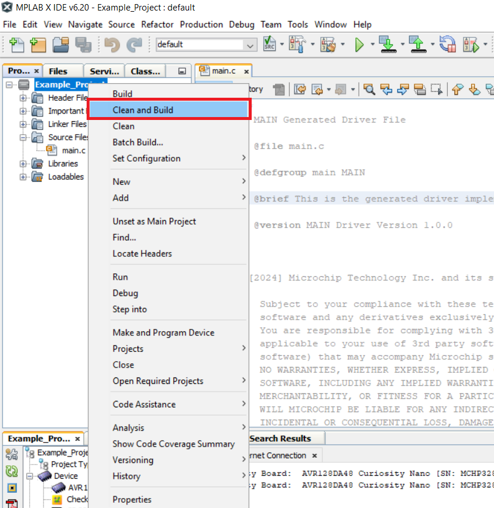

[](https://www.microchip.com)

 # Bi-phase Encoder - Use Case for CIPs Using the AVR128DA48 Microcontroller with MCC Melody

The Bi-phase Mark Code (BMC) combines both data and clock in a single signal. One clock cycle is a BMC bit period. A transition always occurs at the beginning of each bit period. A logic ```1``` is represented by a transition (rising or falling edge) in the middle of the bit period.
A logic ```0``` is represented by no transition in the middle of the period. A BMC encoder accepts a data signal and clock signal as inputs and produces a single BMC-encoded output. A BMC decoder accepts a BMC-encoded signal as the input and produces two outputs: data and clock.
BMC is used in standards such as the USB 3.1 Power Delivery Specification CC signaling, AES3 digital audio, or S/PDIF audio.

An example is presented in the figure below:

<br>

## Related Documentation

More details and code examples on the AVR128DA48 can be found at the following links:
- [AVR128DA48 Product Page](https://www.microchip.com/wwwproducts/en/AVR128DA48)
- [AVR128DA48 Code Examples on Discover](https://mplab-discover.microchip.com/v2?dsl=avr128da48)
- [AVR128DA48 Code Examples on GitHub](https://github.com/microchip-pic-avr-examples?q=avr128da48)

## Software Used

- [MPLAB X IDE v6.20 or newer](https://www.microchip.com/en-us/tools-resources/develop/mplab-x-ide)
- [MPLAB XC8 v2.46 or newer](https://www.microchip.com/en-us/tools-resources/develop/mplab-xc-compilers/xc8)
- [AVR-Dx_DFP v2.4.286 or newer](https://packs.download.microchip.com/)

## Hardware Used

- The [AVR128DA48 Curiosity Nano Development board (DM164151)](https://www.microchip.com/Developmenttools/ProductDetails/DM164151) is used as a test platform:
<br>

## Operation

To program the Curiosity Nano board with this MPLAB X project, follow the steps provided in the [How to Program the Curiosity Nano Board](#how-to-program-the-curiosity-nano-board) chapter.<br><br>

## Concept

This project is an implementation of a Bi-phase Encoder using CIPs by following the interaction between USART, EVSYS, SPI and CCL peripherals. The raw data is received via serial communication, encoded using the circuit composed of the CIP mentioned above and sent further through a single data wire. 

The raw data is received via serial communication by the USART1 peripheral. This data is then stored in a buffer and used as input for the SPI0 peripheral which generates Non-Return-to-Zero (NRZ) data signal and a clock signal. Those signals are selected as inputs for the circuit composed of CCL and EVSYS which outputs the Bi-phase encoded signal. A First-In First-Out (FIFO) buffer mechanism is used from the generated libraries for USART peripheral to facilitate the data storage and minimize data loss.

The block diagram of this application is presented in the figure below: 

<br>

After initializing all the peripherals, a start byte is sent for calibration purposes. The data received from the PC terminal is received by the USART peripheral and stored into the internal usart1RxBuffer via receive interrupt. In the main function, the data from the receive buffer is read byte by byte until the end and follows the flowchart below. A start byte and a stop byte describe each message stored into the internal buffer. A delay, ```GAP_DURATION```, is needed between the start byte and the first read byte from the PC terminal, to avoid the scenario when the FIFO buffer is empty.

<br>

## Setup

The following peripheral and clock configurations are set up using the MPLAB Code Configurator (MCC) Melody for the AVR128DA48:

1. Clock Control:
  - Oscillator Frequency Selection: 4 MHz system clock (default)
  <br>

2. Interrupt Manager:
  - Global Interrupt Enable: Enabled
  - USART1 RXC: Enabled

3. USART1:
  - UART PLIB Selector: USART1
  - Requested Baudrate: 38400
  - Data Size: 8
  - Stop Bits: 1
  - Interrupt Driven: Enabled
  - Software Receive Buffer Size: 128
  - Enable USART Receiver: Enabled
  - Receive Interrupt Enable: Enabled
  <br>

4. SPI0:
  - SPI Host PLIB Selector: SPI0
  - SPI0 Type: Host
  - SPI0 Mode: Mode 1
  - Config Name: HOST_CONFIG
  - Requested Speed (kHz): 31.25 (31250 Hz)
  <br>

5. EVSYS:
  - Event Generators:
    - CCL_LUT0: CHANNEL0
    - CCL_LUT2: CHANNEL1
    - CCL_LUT5: CHANNEL2
  - Event Users:
    - CHANNEL0: CCLLUT4A
    - CHANNEL1: CCLLUT4B
    - CHANNEL2: CCLLUT0A

5. CCL:
  - Enable CCL: Enabled
  - LUT0:
    - Enable LUT: Enabled
    - Enable LUT output: Enabled
    - Filter Options: DISABLE
    - Clock Selection: IN2
    - Sequential Logic: DFF
    - IN0: SPI0
    - IN1: Feedback
    - IN2: EVENT A
    - Gate Type: Custom
    - OUT result: 0x66

  - LUT1:
    - Enable LUT: Enabled
    - Enable LUT output: Enabled
    - Filter Options: DISABLE
    - Clock Selection: CLKPER
    - Sequential Logic: DFF
    - IN0: MASK
    - IN1: MASK
    - IN2: MASK
    - Gate Type: Custom
    - OUT result: 0xFF

  - LUT2:
    - Enable LUT: Enabled
    - Enable LUT output: Enabled
    - Filter Options: DISABLE
    - Clock Selection: IN2
    - Sequential Logic: DFF
    - IN0: FEEDBACK
    - IN1: MASK
    - IN2: SPI0
    - Gate Type: Custom
    - OUT result: 0x55

  - LUT3:
    - Enable LUT: Enabled
    - Enable LUT output: Enabled
    - Filter Options: DISABLE
    - Clock Selection: CLKPER
    - Sequential Logic: DFF
    - IN0: MASK
    - IN1: MASK
    - IN2: MASK
    - Gate Type: Custom
    - OUT result: 0xFF

  - LUT4:
    - Enable LUT: Enabled
    - Enable LUT output: Enabled
    - Filter Options: FILTER
    - Clock Selection: CLKPER
    - Sequential Logic: DISABLE
    - IN0: EVENTA
    - IN1: EVENTB
    - IN2: MASK
    - Gate Type: Custom
    - OUT result: 0x6

  - LUT5:
    - Enable LUT: Enabled
    - Enable LUT output: Disabled
    - Filter Options: DISABLE
    - Clock Selection: CLKPER
    - Sequential Logic: DFF
    - IN0: MASK
    - IN1: MASK
    - IN2: SPI0
    - Gate Type: Custom
    - OUT result: 0x01

 |Pin                       | Configuration      |
 | :---------------------:  | :----------------: |
 |     PA4 (SPI0 - MOSI)    |   Digital Output   |
 |     PA6 (SPI0 - SCK)     |   Digital Output   |
 |     PC1 (USART1 - RX)    |   Digital Input    |
 |     PB3 (LUT4_OUT) - Bi-phase Encoded Signal       |   Digital Output   |

 **Important:** The encoder's board PB3 pin must be connected with the decoder's board PB0 pin (Bi-phase data bus).

## Demo

In the demo, the ```Microchip!``` message was inserted by the user in the terminal. Pin PB3 - BMC out (the output pin for the Bi-phase encoded signal) is visualized using a logic analyzer.

<br>

To use the embedded decoder from the Logic software, the next analyzers settings must be set:
<br>

 ## Summary

This demo shows how to implement a CIP solution for a Bi-phase encoder using USART, CCL and Event System peripherals. This CIP solution can be used at high baud rates, the encoding process being implemented with minimum effort from the CPU.

##  How to Program the Curiosity Nano Board

This chapter demonstrates how to use the MPLAB X IDE to program an AVR® device with an Example_Project.X. This is applicable to other projects.

1.  Connect the board to the PC.

2.  Open the Example_Project.X project in MPLAB X IDE.

3.  Set the Example_Project.X project as main project.
    <br>Right click the project in the **Projects** tab and click **Set as Main Project**.
    <br>

4.  Clean and build the Example_Project.X project.
    <br>Right click the **Example_Project.X** project and select **Clean and Build**.
    <br>

5.  Select **AVRxxxxx Curiosity Nano** in the Connected Hardware Tool section of the project settings:
    <br>Right click the project and click **Properties**.
    <br>Click the arrow under the Connected Hardware Tool.
    <br>Select **AVRxxxxx Curiosity Nano** (click the **SN**), click **Apply** and then click **OK**:
    <br>

6.  Program the project to the board.
    <br>Right click the project and click **Make and Program Device**.
    <br>

<br>

- - - 
## Menu
- [Back to Top](#bi-phase-encoder---use-case-for-cips-using-the-avr128da48-microcontroller-with-mcc-melody)
- [Back to Related Documentation](#related-documentation)
- [Back to Software Used](#software-used)
- [Back to Hardware Used](#hardware-used)
- [Back to Operation](#operation)
- [Back to Concept](#concept)
- [Back to Setup](#setup)
- [Back to Demo](#demo)
- [Back to Summary](#summary)
- [Back to How to Program the Curiosity Nano Board](#how-to-program-the-curiosity-nano-board)